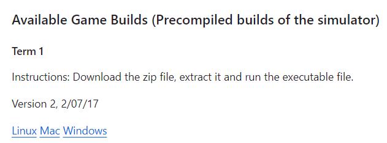
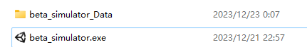

# Selfdriving Car

## Project Introduction

This project is to build a deep neural network to clone driving behavior. The model will output a steering angle to an autonomous vehicle. The model will be trained and validated on the data set collected by myself. The model will then be tested on the simulator to drive the car autonomously around the track.

## Demo

    

## 📂 Project Organization

    ├── data
    │   ├── IMG                 <- Images from the three cameras of the car
    │   ├── driving_log.csv     <- The driving log file
    ├── miscellaneous
    │   ├── demo_videos
    │       └── video.mp4      <- The video of the car driving autonomously 
    │   ├── images
    │
    ├── model.py           <- The script to create and train the model
    ├── drive.py           <- The script to drive the car in autonomous mode
    ├── model.h5           <- The model weights
    ├── video.mp4          <- The video of the car driving autonomously around the track
    └── writeup_report.md  <- The writeup report
    ├── README.md          <- The top-level README for developers using this 
project.

## ✅ Quickstart for this project

1. Install CUDA and cuDNN, please refer to the following links:

   <https://blog.csdn.net/anmin8888/article/details/127910084>

   <https://developer.nvidia.com/cuda-11-7-0-download-archive>

   <https://developer.nvidia.com/rdp/cudnn-download>

    Install folder path for cuda is

    `C:\Program Files\NVIDIA GPU Computing Toolkit\CUDA\v11.7`
2. Create your own virtual enviroment and install all dependencies

   `pip install -r requirements.txt`
3. Activate the virtual environment, in this project, I use the virtual   environment created by python. Python located at venv_self_driving_car/scripts/python.exe, use activate.bat to activate the virtual environment.

   `venv_self_driving_car/scripts/activate.bat`
4. Run the model with the simulator

   `python drive.py model.h5`
5. Run the simulator in autonomous mode, which could be downloaded from <https://github.com/udacity/self-driving-car-sim>

   

   

## Reference

<https://www.kaggle.com/code/ookanshouoo/unity>

<https://github.com/woges/UDACITY-self-driving-car/tree/master>

## Next Step

1. Create a notebook to load the model, and test with the pictures, check if the result is correct.
2. Check the original repo, how there train the model, find the difference. What kind of data are used to train the model. If it is the same like what we are using in the 'ModelTraining_BehaviorCloning' notebook.
3. Add more explanation to the notebook 'ModelTraining_BehaviorCloning'.
